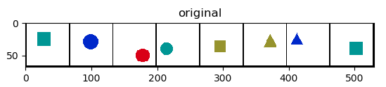

# VAE-SBD

PyTorch implementation of the [Variational Autoencoder with Spatial Broadcast Decoder](https://arxiv.org/abs/1901.07017).

<div align="center">
</br></br>
</br></br>
</div>

## Instructions

Create a conda environment with all the requirements (edit `environment.yml` if you want to change the name of the environment):

```sh
conda env create -f environment.yml
```

Activate the environment

```sh
source activate pytorch
```

Generate the data

```sh
python generate.py
```

Train the model

```sh
python train.py
```

Training on GPU for 100 epochs should take about 3 hours.

**Acknowledgements**

Thanks to Nicholas Watters for very helpful pointers for the implementation.
